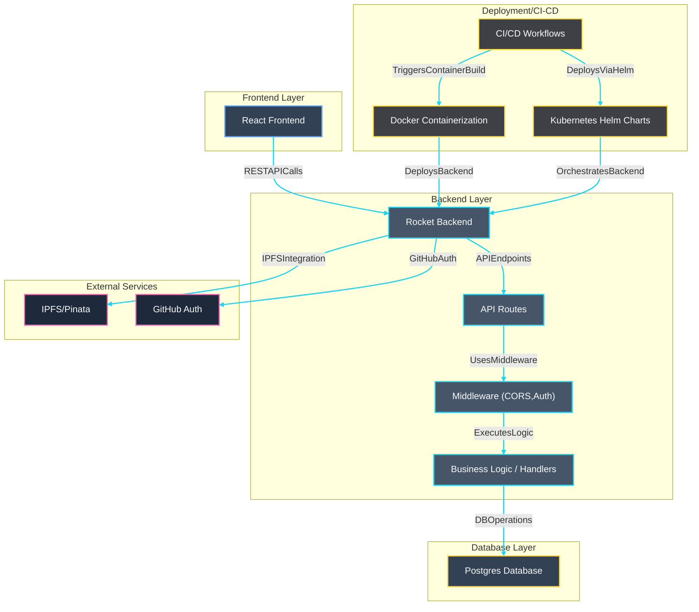

# forc.pub

[](https://docs.rs/forc/)
[](https://discord.gg/xfpK4Pe)

Welcome to the GitHub repository for [forc.pub](https://forc.pub/), the official package registry for the Sway programming language.

## How it Works

`forc.pub` has a simple multi-threaded Rocket backend server which stores and fetches package metadata in a Postgres database. Packages are stored in a dedicated IPFS network, and package metadata is indexed and stored in [forc.pub-index](https://github.com/FuelLabs/forc.pub-index).

The frontend uses React and TypeScript.

## Forc Documentation

For user documentation, including installing release builds, see: <https://docs.fuel.network/docs/forc/>.

## Building from Source

This section is for local development of `forc.pub`.

### Dependencies and Tools

`forc.pub` is built in Rust and TypeScript. To begin, install the Rust toolchain following instructions at <https://www.rust-lang.org/tools/install>. Then configure your Rust toolchain to use Rust `stable`:

```sh
rustup default stable
```

If not already done, add the Cargo bin directory to your `PATH` by adding the following line to `~/.profile` and restarting the shell session.

```sh
export PATH="${HOME}/.cargo/bin:${PATH}"
```

You will also need to install [Node.js](https://nodejs.org/en/learn/getting-started/how-to-install-nodejs).

To run the Postgres database locally, you will need [Docker](https://docs.docker.com/engine/install/).

To connect to the database, you will need the [Diesel CLI](https://diesel.rs/guides/getting-started).

Diesel is the Rust ORM used to create and run database migrations. It requires a separate C library called `libpq` to be installed as well.

```sh
# Mac only
brew install libpq

# Ubuntu only
apt-get install libpq5

# Install diesel CLI
cargo install diesel_cli --no-default-features --features postgres

# On macOS-arm64, you may need additional rust flags:
RUSTFLAGS='-L /opt/homebrew/opt/libpq/lib' cargo install diesel_cli --no-default-features --features postgres
```

See [docs/database.md](database.md) for more information about working with the database.

### Building the `forc.pub` server

Clone the repository and build the Sway toolchain:

```sh
git clone git@github.com:FuelLabs/forc.pub.git
cd forc.pub
cargo build
```

Confirm the server built successfully:

```sh
cargo run --bin forc.pub
```

### Running the `forc.pub` server

Before starting the server, the local database must be up and running.

```sh
./scripts/start_local_db.sh
```

Next, set up the environment by copying `.env.example` to `.env.local`, and modifying `.env.local` with your Pinata test gateway details and Github App env (if testing github login functionality).

Now we can run the server with:

```sh
cargo run
```

Alternatively, the server can be run locally with Docker, as it is in the deployed environment.

```sh
./scripts/start_local_server.sh

# Force the server image to be rebuilt
./scripts/start_local_server.sh -f
```

### Manually trigger the APIs

You can manually trigger the APIs with curl, for example:

```bash
curl -X POST "http://localhost:8080/upload_project?forc_version=0.66.5" \
  -H "Content-Type: application/gzip" \
  --data-binary "@tests/fixtures/sway-project.tgz"
```

### Running the Frontend

The frontend requires npm and node to be installed.

```sh
cd app
npm i
npm start
```

This will open http://localhost:3000 in your browser. By default, it will use the local server endpoint, so the local server must be running.

## Architecture diagram



## Contributing

We are not currently accepting contributions to `forc.pub` as the MVP is still being developed.
